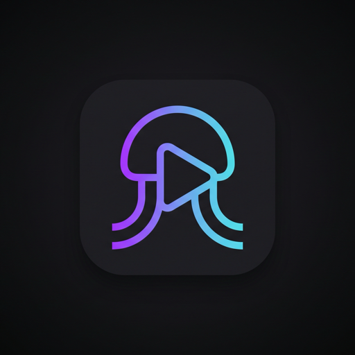

<p align="center">
  
</p>

<h1 align="center">Jellino</h1>

<p align="center">
  <strong>A lightweight, personal bridge connecting your Nuvio account to the Jellyfin client ecosystem.</strong>
</p>

Jellino runs on your own free Cloudflare account. It translates between the **Jellyfin protocol** on the front and your **Nuvio account** + **Stremio addons** on the back. It is not a standalone media server: there is no local storage, no file hosting, and no transcoding. Video streams are passed directly to player clients as secure HTTP URLs.

---

## Why Jellino Was Built

Because native Stremio and Nuvio apps are not available on the iOS and tvOS App Store, Apple users could not easily access their Nuvio setup on iPhone, iPad, or Apple TV. 

Jellino was built as a bridge so you can:
- Watch on any TV, PC, or Android device using the **official Nuvio apps**.
- Pick up right where you left off on your **Apple devices** (or any Jellyfin app) without leaving the Nuvio ecosystem.
- Keep all watch progress, continue watching, libraries, and favorites synchronized in one central place: your Nuvio account.

> [!NOTE]
> **Use official Nuvio apps when available.** Jellino is not a replacement for Nuvio — it is a bridge designed specifically for devices that lack official Nuvio apps.

---

## Tested Addons & Client Recommendations

- **Metadata Provider:** Tested and tuned using [AIOMetadata](https://github.com/cedya77/aiometadata).
- **Streams Provider:** Tested and tuned using [AIOStreams](https://github.com/Viren070/AIOStreams). Requires a debrid service or direct HTTPS streams (no P2P / torrent streaming).
- **Recommended Jellyfin Clients:** 
  - **Moonfin** (Apple TV, iOS, iPadOS, macOS, Android, Windows)
  - **Odin** (iOS, iPadOS, tvOS via TestFlight)
  *(These are the two clients the author likes the most and did all testing on. Other Jellyfin clients work through standard Jellyfin APIs.)*

---

## Quick Deploy & Setup

1. **Fork or clone** this repository.
2. **Deploy to Cloudflare Workers:**
   - In Cloudflare dashboard: Create a Worker from your repository. Cloudflare automatically sets up the D1 database (`jellino-db`).
   - Or deploy via CLI: `bun run deploy`.
3. **Open your Worker URL:**
   - The setup wizard will guide you to link your **Nuvio account** (create one at [nuvio.tv](https://nuvio.tv) or inside the Nuvio app).
   - It automatically imports your profiles, addons, home catalog layout, collections, and watch progress.
4. **Connect your clients:**
   - Open Moonfin, Odin, or your client of choice.
   - Enter your Jellino Worker URL.
   - Sign in using your profile credentials or pair instantly via **Quick Connect** (6-digit PIN).

Jellino advertises Jellyfin **12.1.0**, the version modern Jellyfin SDKs require.

---

## What Syncs with Your Nuvio Account

- **Profiles** &mdash; up to six, imported 1:1 (avatars included). There are no local accounts: a Nuvio account is required, and profiles are added, renamed, disabled, or removed only in Nuvio. Admins set a client password per profile, or clients use Quick Connect.
- **Addons** &mdash; the same addons, order, and enabled state as Nuvio. Managed only in Nuvio.
- **Library** &mdash; exactly Nuvio's home catalogs: same rows, order, titles, and hidden rows, with no local editor and no item cap. Nuvio collection folders become Jellyfin BoxSets under Collections.
- **Continue Watching / Next Up** &mdash; pulled from Nuvio every 60 s when a client asks, reconciled every 15 minutes against the full account, and pushed back immediately on playback start, progress, and stop.
- **Mark Watched / Unwatched** &mdash; Jellyfin's buttons write to Nuvio. Remove-from-continue-watching (`ExcludeContinueWatching` / `UserHiddenItems`) works too and follows Nuvio's semantics.
- **Favorites** &mdash; Jellyfin favorites are your Nuvio Library, in both directions.
- **Watch state is Nuvio-only** &mdash; no second tracker. If Trakt or another scrobbler is connected inside Nuvio, Nuvio forwards it.

Deletes are protected by causal tombstones, so a stale sync can never resurrect something you removed.

---

## Feature Provenance & Implementation

Jellino adopts proven patterns from established open-source projects rather than reinventing custom wheels:

| Feature | Adopted From | Implementation & Jellino Choice |
| :--- | :--- | :--- |
| **Subtitle Pipeline** | [AIOMetadata](https://github.com/cedya77/aiometadata) (`feat/jellyfin-server`) | Direct 1:1 port (list &rarr; pick &rarr; advertise &rarr; click &rarr; serve). Serves 8 tracks per language (max 40) and decodes legacy encodings (e.g. Windows-1256 Arabic). Zero proxying or transcoding. |
| **Metadata & DTOs** | [AIOMetadata](https://github.com/cedya77/aiometadata) | Full Jellyfin metadata mapping for movies, series, seasons, episodes, people, ratings, and studios. Multi-addon fallback merges missing overview, cast, or season art. |
| **Media Segments** | [AIOMetadata](https://github.com/cedya77/aiometadata) + PublicMetaDB | Skip intro, outro, and recap segments queried via PublicMetaDB &rarr; AniSkip &rarr; IntroDB. |
| **Stream Extraction** | [AIOMetadata](https://github.com/cedya77/aiometadata) / AIOStreams | Maps parsed release tags, audio channels (Atmos, DTS), and stream qualities directly to Jellyfin MediaSources. Streams redirect directly to provider URLs. |
| **Protocol Surface & BoxSets** | [Remux](https://github.com/lostb1t/remux) | Standard Jellyfin endpoints, virtual folders, BoxSets, and theme styling. |
| **Continue Watching & Next Up** | Unified Hybrid | Blends in-progress items with next-up episodes and sorts by `UserData.LastPlayedDate`, ensuring seamless resume on both Odin and Moonfin. |
| **Nuvio Account & Sync** | [Nuvio self-host](https://github.com/NuvioMedia/self-host) & [Nuvio Account Manager](https://github.com/techuhak/Nuvio-Account-Manager) | Profiles, addons, home layouts, and collections mirror Nuvio 1:1. Watch progress syncs every 60s and on play/stop; full sync runs via 15-minute cron or admin button. |
| **Client Actions & Tombstones** | [NuvioTV](https://github.com/NuvioMedia/NuvioTV) + Jellyfin | Removing an item from continue watching deletes it locally and in Nuvio with causal tombstones preventing resurrection. |
| **Client Auth & Quick Connect** | [jellyfin/jellyfin](https://github.com/jellyfin/jellyfin) | Standard Jellyfin user auth, password hashing, and 6-digit Quick Connect pairing for TV devices. |

`docs/reference-projects.md` lists the pinned commit for each project and the procedure for pulling upstream changes.

### Deliberate deviations from the references

| Feature | Reference behavior | Jellino behavior | Why |
| :--- | :--- | :--- | :--- |
| Subtitle tracks per language | 3 (`JELLYFIN_SUBTITLES_PER_LANGUAGE`) | 8, total still capped at 40 | More choice per language without unbounded menus. |
| Subtitle addon fanout | Queries one stream addon base | Queries all enabled subtitle-capable addons | Mirrors the profile's Nuvio addon list. |
| Subtitle text decoding | Assumes raw UTF-8 | BOM/UTF-16 detection, legacy code pages, gzip | Arabic and non-Latin subtitles from real addons. |
| Subtitle offer store | Rebuilds only on a cache miss | Rebuilds once on a stale index; item-detail requests never write offers | Keeps the playback menu and the clicked track consistent. |
| Logout (`/Sessions/Logout`) | Revokes the calling access token | Local-only; revoke devices by setting a new client password (bumps the token epoch) | No server-side session store on the free tier. |
| Artwork URLs | Served from local files | 302 redirect to provider CDNs, never host-restricted | Required for Stremio addon artwork; only the Worker's own fetch targets are validated. |

---

## Client Context Menu Actions & Nuvio Sync Status

When interacting with Continue Watching or item cards in Jellyfin clients (such as **Odin** and **Moonfin**), actions map to your Nuvio account and Stremio addons as follows:

| Action | Clients | Jellino Status | Nuvio Ecosystem Sync | Behavior & Details |
| :--- | :--- | :--- | :--- | :--- |
| **Resume** / Play | Odin, Moonfin | Supported | Synced to `watch_progress` | Resumes playback at last saved position ticks; reports live playback progress to Nuvio. |
| **Mark Watched** / Mark as Watched | Odin, Moonfin | Supported | Synced to `watched_items` & clears `watch_progress` | Pushes watched entry to Nuvio `watched_items` via `sync_push_watched_items` and removes from in-progress rows. |
| **Remove from Continue Watching** / **Hide from Continue Watching** / **Hide from Next Up** | Odin, Moonfin | Supported | Synced to `watch_progress` & Tombstones | Deletes progress row locally in D1 and remotely from Nuvio `watch_progress`; writes a persistent tombstone to prevent resurrection on sync. |
| **Add to Favorites** | Odin, Moonfin | Supported | Synced to Nuvio Library (`profile_library`) | Toggles favorite status in D1 and synchronizes directly to Nuvio Library via `sync_push_library_item` / delete. |
| **Season Watched** / **Season Unwatched** | Odin | Supported | Synced to `watched_items` & `watch_progress` | Resolves season episodes from addon metadata; batch marks all episodes played/unplayed in D1 and pushes/clears them in Nuvio `watched_items`. |
| **All episodes up to here watched** / **unwatched** | Odin | Supported | Synced to `watched_items` & `watch_progress` | Odin client-side issues individual played state API calls for all episodes from S01E01 up to the selected episode; Jellino syncs each to Nuvio. |
| **Go To Show** / **Go to Series** | Odin, Moonfin | Supported | N/A (Client Navigation) | Navigates the client to the full series details page. |
| **Refresh Metadata** | Moonfin | Supported | In-Memory Cache Invalidation | Purges Jellino's in-memory item DTO cache (`/Items/:id/Refresh`) and returns 204 No Content. Upstream addon metadata re-fetches freshly on next view. |
| **Like** / **Dislike** | Odin | Handled (200 Stub) | No Nuvio Equivalent | Handled with clean 200 OK responses to prevent client error popups. Nuvio has no user rating or like/dislike system in its DB or apps, so no wasteful D1 writes or orphaned data are created. |
| **Add to Collection** | Moonfin | Not Applicable | No Nuvio Equivalent | Jellyfin collections are static BoxSets. In Nuvio, collections are dynamic curated catalogs (addon catalogs, Trakt/TMDB lists); bookmarking individual episodes/movies into collections is not supported in Nuvio. |
| **Add to Playlist** | Moonfin | Not Applicable | No Nuvio Equivalent | Jellyfin playlists are `.m3u` server files. Nuvio has no playlist feature. |
| **Identify** / **Change Artwork** | Moonfin | Not Applicable | Stremio Immutability | Local media server scrapers for manually overriding artwork/IDs. Jellino streams strictly from Stremio addons where IDs (IMDb/TMDB) and artwork CDN URLs are immutable and provided directly by the addons. |

---

## Cloudflare Free Tier

Runs entirely on Cloudflare's generous free tier:
- One Worker, one D1 database, and the Cache API.
- No paid add-ons: no R2, KV, Durable Objects, or Queues.
- Artwork redirects straight to provider CDNs.
- A simulated day for a family of six (`tests/sim-day.test.ts`) stays under 15k Worker requests, 50k D1 reads, and 15k D1 writes &mdash; less than 15% of your free caps.

---

## Admin Dashboard

Access at `https://<your-worker>.workers.dev/admin`:
- **Dashboard** &mdash; server health, version, and Quick Connect PIN authorization.
- **Nuvio Sync** &mdash; manual one-click sync, connection status, and addons per profile.
- **Addon Manager** &mdash; overview of synced addons, health metrics, and direct link to Nuvio's addon manager.
- **Nuvio Profiles** &mdash; imported profiles, per-profile client passwords, and TV pairing.
- **General Settings** &mdash; optional PublicMetaDB API key (skip intros) and TMDB API key (person pages).
- **Logs & Debug** &mdash; real-time timestamped event logs for streams, subtitles, catalogs, and sync events with category/level filters, client attribution, and copy support.

---

## Development

```bash
bun install
bun run dev        # wrangler dev with local D1 (wrangler.local.toml)
bun run test       # vitest test suite with in-memory D1
bun run typecheck  # TypeScript compiler check
bun run deploy     # Deploy to Cloudflare Workers
bunx fallow        # Static analysis: dead code, duplication, complexity
bunx fallow audit --base origin/main  # Gate only findings a change introduces
```

`src/` carries zero comments by rule (enforced in CI). Reference checkouts live in `tmp/` and are gitignored. Fallow's `.fallowrc.json` treats the test suite as entry points so test-only usage is not reported as dead code.

---

## Credits & Acknowledgements

Jellino stands on the shoulders of several outstanding open-source projects in the media streaming and Stremio/Jellyfin communities:

- **[AIOMetadata](https://github.com/cedya77/aiometadata)** by [cedya77](https://github.com/cedya77) &mdash; Metadata mapping, Jellyfin DTO conversion, subtitle decoding/serving pipeline, and media segment integration.
- **[Remux](https://github.com/lostb1t/remux)** by [lostb1t](https://github.com/lostb1t) &mdash; Jellyfin protocol surface architecture, virtual folders, BoxSets, and dashboard theme foundation.
- **[AIOStreams](https://github.com/Viren070/AIOStreams)** by [Viren070](https://github.com/Viren070) &mdash; Stremio stream resolution and parsed file attributes.
- **[Nuvio](https://nuvio.tv)** &amp; **[NuvioTV](https://github.com/NuvioMedia)** &mdash; The multi-profile media sync ecosystem and self-hosted backend schemas.
- **[Moonfin](https://github.com/MoonfinApp)** &amp; **Odin** &mdash; Outstanding Jellyfin client apps that bring modern media streaming experiences to Apple TV and iOS.
- **[Hono](https://hono.dev)** &mdash; Ultra-fast, lightweight web framework powering Jellino on Cloudflare Workers.

---

## License

This project is licensed under the **GNU Affero General Public License v3.0 or later** ([AGPL-3.0-or-later](LICENSE)).

Because Jellino incorporates and adapts core components from open-source projects licensed under AGPL-3.0 (Remux) and GPL-3.0 (AIOMetadata, NuvioTV), it is released under AGPL-3.0 to honor copyleft open-source licensing requirements and ensure all improvements remain free and open to the community.
